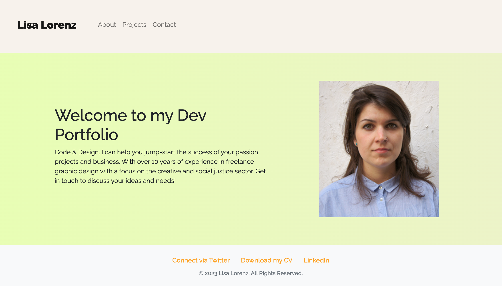
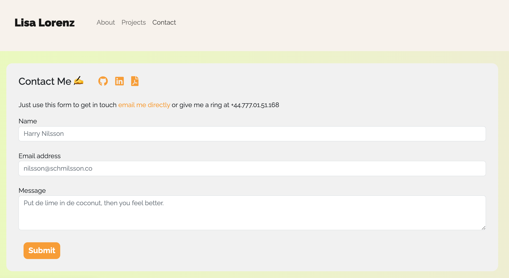
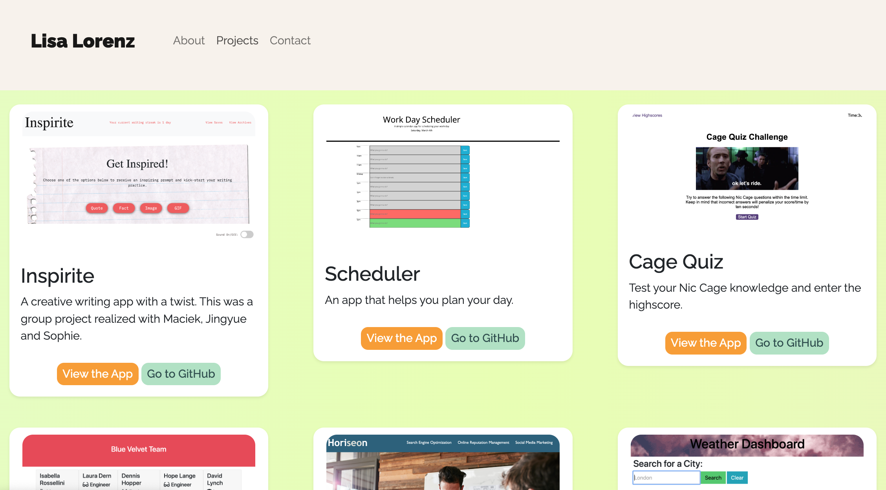
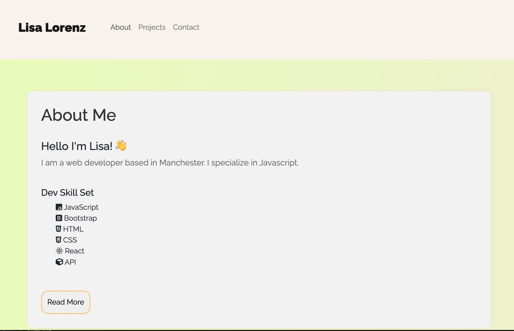

# React Portfolio Challenge

  [](https://opensource.org/licenses/MIT)<br>

A project built from scratch with React, Bootstrap, and CSS - that helps you showcase your work in a simple and no-nonesense manner.

## Table of contents
1. [Getting Started](#toc-gettingstarted)
2. [Summary](#toc-summary)
3. [App Description](#toc-appdescription)
4. [Usage](#toc-usage)
5. [License](#toc-license)
6. [Collaborators](#toc-collaborators)
7. [Contribute](#toc-contribute)
8. [Tests](#toc-tests)
8. [FAQ](#toc-faq)
10. [Contact](#toc-contact)


## Getting Started <a name="toc-gettingstarted"></a>
This application requires [React](https://www.youtube.com/watch?v=jp1sQZPQ_Rw) use the following commands to get started.

[Have a look at this tutorial](https://github.com/gitname/react-gh-pages) that shows you how to get started with React. You will need this command to get started:

```javascript
npm start
```

And make sure you have React Bootstrap in your package:

```javascript
npm install react-bootstrap 
```

Once you have these dependencies installed, you can launch the rendered application in your browser instantly.

## Summary Description <a name="toc-summary"></a>
This project includes all the information needed to kick-start your carreer in web engineering. Its clear structure and simplicity gives a good overview of your work and it's dynamically generated structure lets you add new content easily. 


## User Story

### As an candidate who is looking for a job in web development:

- I want to present a polished portfolio
- So that I can be seen and showcase my work to fellow developers and potential employers.


# App description <a name="toc-appdescription"></a>

This program can be used via the VS Code Terminal to create a portfolio for your projects. It uses React to dynamically create an application, such as the project landing page, contact form, project history, and short bio.

## Who is the target audience?

This application might be of use to all who are new to coding who need a basic scaffold to showcase their work. Feel free to adapt styling to your taste.

## What is the problem that it addresses?

As a developer I want to showcase my projects and update them regularly.

## How does the product solve that problem?

The application offers a clean layout that can easily expanded and changed by adding projects to a JSON file that's linked to a project page.


# Usage <a name="toc-usage"></a>

Use the following command in your VS Code terminal to get started with receiving the prompts:

```javascript
npm start
```

Check out my [GitHub Repo](https://github.com/LisaMLorenz/reactportfoliolisa) to see the required code in more detail.

Here are a few more screenshots to illustrate the rendered application. 



Contact Form:



Project Page:




About Page:




## License <a name="toc-license"></a>

This project is licensed under the MIT license.

## Collaborators <a name="toc-collaborate"></a>

For now it's just - [Lisa Lorenz](https://github.com/LisaMLorenz). We are looking forward to welcome contributors though. I had some help with debugging from Lissa Simpson.

## How to Contribute <a name="toc-contribute"></a>
If you would like to contribute to this project, please follow these steps:

1. Fork the repository.
2. Create a new branch.
3. Make your changes and commit them.
4. Push your changes to your fork.
5. Submit a pull request.

## Tests <a name="toc-tests"></a>

This application was thoroughly tested to ensure that it performs as expected and without any bugs. The testing was conducted using the VS Code Terminal with React.

To test the application, we ran multiple scenarios in which we input different values in response to the prompts generated by the application. We also tested the application with different combinations of inputs to verify that it handles all cases correctly.

During testing, we didn't encounter any issues or errors. The application performed smoothly, generating a high-quality README file with all the required sections and information.

If you encounter any issues or bugs while using the application, please don't hesitate to report them by opening an issue in the GitHub repository. We'll do our best to address them promptly.

## FAQ <a name="toc-faq"></a>

1. What if I don't want to add my own projects?
- You can simply add your own details via the projects.json file.
2. What if I want to change links to other websites like Instagram?
- The application uses the fontawesome library that provides icons and logos for all the apps you need!
3. Can I customize styling?
- Of course, there are style forms for each page.

## Any more questions? <a name="toc-contact"></a>

Please get in touch via [GitHub](https://github.com/LisaMLorenz) or contact me directly via hej@frau-lorenz.de.
